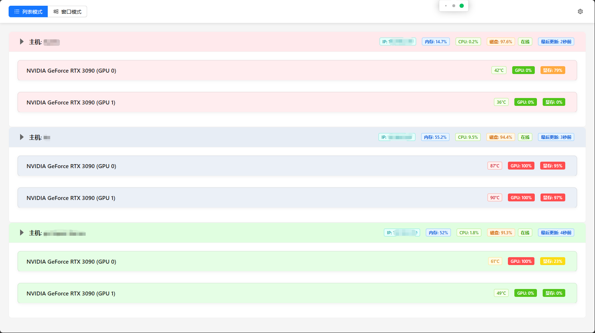

# GPU 监控系统

项目缘由来于我有使用多台GPU机器的使用场景，查找到的开源GPU管理平台，要么太重，要么残缺不全。无奈之下所以写了一个用于监控多台机器 GPU 使用情况的实时监控系统，来满足需求后，希望分享给更多可能需要的人。

本项目包括客户端、服务端和网页前端三个部分。还可查看docker下的GPU容器，使用GPU资源的进程，使得对GPU资源进行查询管理更加方便。



## 功能特点

### 客户端
- 实时收集 GPU 使用数据
- 收集系统信息(CPU、内存、磁盘使用率)
- 收集 Screen 会话信息
- 收集 Docker 容器信息及其 GPU 使用情况
- 定时向服务器报告数据

### 服务端
- 接收并存储多台机器的 GPU 监控数据
- 提供 RESTful API 接口
- 支持实时数据查询

### Web 前端
- 支持列表模式和窗口模式两种视图
- 实时展示 GPU 使用情况
- 支持查看进程详情
- 支持 Screen 会话管理
- 支持 Docker 容器管理
- 支持全局进程搜索
- 支持自定义刷新间隔
- 支持离线状态显示
- 响应式设计,支持紧凑模式

## 项目结构

```
gpu-monitor/
├── backend/
│   ├── gpu_collector.py   # GPU 数据收集客户端
│   └── web_server.py      # Web 服务器
├── frontend/
│   ├── public/
│   │   └── index.html
│   ├── src/
│   │   ├── components/
│   │   │   ├── DockerContainerTable.jsx  # Docker 容器表格组件
│   │   │   ├── GPUCard.jsx               # GPU 卡片组件
│   │   │   ├── Header.jsx                # 页面头部组件
│   │   │   ├── ListView.jsx              # 列表视图组件
│   │   │   ├── SettingsModal.jsx         # 设置弹窗组件
│   │   │   └── WindowView.jsx            # 窗口视图组件
│   │   ├── utils/
│   │   │   └── formatters.js             # 工具函数
│   │   ├── App.jsx                       # 主应用组件
│   │   ├── config.js                     # 配置文件
│   │   └── index.js                      # 入口文件
│   └── package.json
└── README.md
```

## 环境要求

### 后端
- Python 3.6+
- gpustat
- psutil
- Flask
- requests

### 前端
- Node.js 14+
- React 18
- Ant Design 5
- Axios
- Moment.js

## 安装步骤

1. 克隆仓库
```bash
git clone https://github.com/Mick4994/gpu-monitor.git
cd gpu-monitor
```

2. 安装后端依赖
```bash
cd backend
pip install -r requirements.txt
```

3. 安装前端依赖
```bash
cd frontend
npm install
# 或者使用 yarn
yarn install
```

## 使用方法

### 启动后端服务器
```bash
cd backend
python web_server.py
```

### 启动数据收集客户端
只要运行就会自动添加到服务器，无需额外配置
```bash
cd backend
python gpu_collector.py
```

### 启动前端开发服务器
```bash
cd frontend
npm start
# 或者使用 yarn
yarn start
```

## 配置说明

### 前端配置
前端配置可以通过设置界面进行修改,包括:
- API 地址: 默认为 `http://localhost:7864`
- 刷新间隔: 默认为 5000 毫秒
- 默认视图模式: 列表模式或窗口模式

### 后端配置
在 `gpu_collector.py` 中可以配置:
- 数据收集间隔
- 中心服务器地址
- Docker 容器信息更新间隔

## 主要功能说明

### 双浏览模式
- 列表模式
    - 显示所有机器的 GPU 使用情况
    - 多个色卡易于区分不同机器
    - 支持展开/折叠单个机器的详细信息
    - 显示系统信息(CPU、内存、磁盘使用率)
    - 显示 Screen 会话和 Docker 容器信息
- 窗口模式
    - 单机详细信息查看
    - 便利机器切换
    - 页面更加舒适的显示系统信息和进程信息

### Docker 容器管理
- 显示容器状态
- 显示容器资源使用情况
- 显示容器使用的 GPU 设备
- 支持复制进入容器命令

### Screen 会话管理
- 显示会话状态(Attached/Detached)
- 支持快速连接到会话
- 已连接会话的二次确认

### 进程搜索
- 支持按进程名搜索
- 支持按命令行搜索
- 显示进程的 CPU、内存使用率
- 显示 GPU 进程的显存使用情况

## API 接口文档

### 数据上报接口

#### POST /api/report-gpu-stats
客户端向服务器报告 GPU 和系统状态数据。

请求体:
```json
{
  "hostname": "string",          // 主机名
  "timestamp": "string",         // ISO 格式的时间戳
  "gpu_data": [{                 // GPU 数据数组
    "id": "number",              // GPU ID
    "name": "string",            // GPU 名称
    "temperature": "number",     // GPU 温度
    "memory_used": "number",     // 已用显存(MB)
    "memory_total": "number",    // 总显存(MB)
    "utilization": "number",     // GPU 利用率(%)
    "processes": [{              // GPU 进程数组
      "pid": "number",           // 进程 ID
      "name": "string",          // 进程名称
      "cmdline": "string",       // 命令行
      "cpu_percent": "number",   // CPU 使用率
      "memory_percent": "number",// 内存使用率
      "create_time": "number",   // 创建时间
      "status": "string",        // 进程状态
      "username": "string",      // 用户名
      "is_gpu_process": "boolean",// 是否是 GPU 进程
      "gpu_memory_usage": "number",// GPU 显存使用量
      "gpu_id": "number"         // GPU ID
    }]
  }],
  "system_info": {               // 系统信息
    "cpu_percent": "number",     // CPU 使用率
    "memory_total": "number",    // 总内存
    "memory_used": "number",     // 已用内存
    "memory_percent": "number",  // 内存使用率
    "disk_total": "number",      // 总磁盘空间
    "disk_used": "number",       // 已用磁盘空间
    "disk_percent": "number",    // 磁盘使用率
    "ip_address": "string",      // IP 地址
    "screen_sessions": [{        // Screen 会话数组
      "pid": "string",          // 会话 PID
      "name": "string",         // 会话名称
      "status": "string"        // 会话状态(Attached/Detached)
    }],
    "docker_containers": [{      // Docker 容器数组
      "id": "string",           // 容器 ID
      "name": "string",         // 容器名称
      "status": "string",       // 容器状态
      "image": "string",        // 镜像名称
      "memoryUsage": "number",  // 内存使用量
      "gpuDevices": "string"    // GPU 设备信息
    }],
    "processes": [{             // 所有进程数组
      // 与 GPU 进程格式相同
    }]
  }
}
```

响应:
```json
{
  "status": "success",
  "message": "Data received"
}
```

#### GET /api/gpu-stats
获取所有机器的 GPU 和系统状态数据。

响应:
```json
{
  "machines": {
    "hostname1": {
      // 与上报数据格式相同
    },
    "hostname2": {
      // 与上报数据格式相同
    }
  }
}
```

### 错误响应
所有接口在发生错误时都会返回以下格式:
```json
{
  "status": "error",
  "message": "错误信息描述"
}
```

### 状态码说明
- 200: 请求成功
- 400: 请求参数错误
- 404: 资源不存在
- 500: 服务器内部错误

### 注意事项
1. 所有时间戳均使用 ISO 格式
2. 所有数值类型的内存大小单位均为字节(B)
3. 所有百分比数值范围为 0-100
4. GPU 设备信息格式为 JSON 字符串，例如: "[0,1]" 